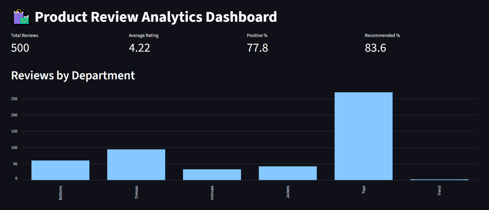
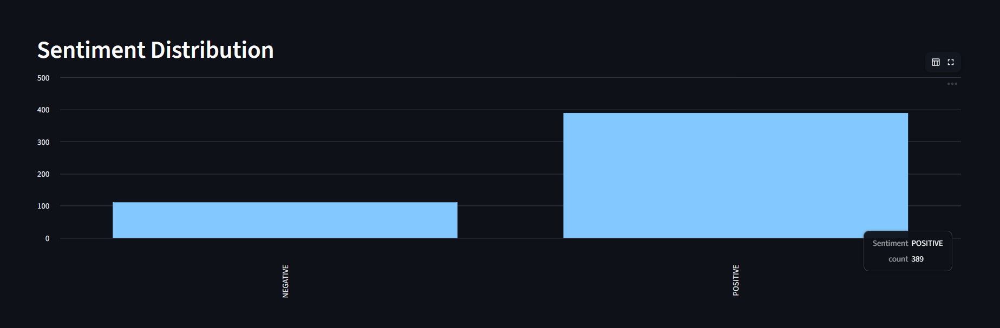
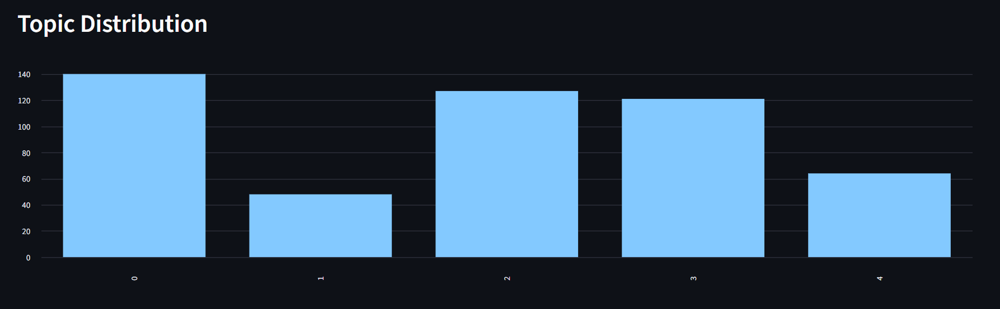
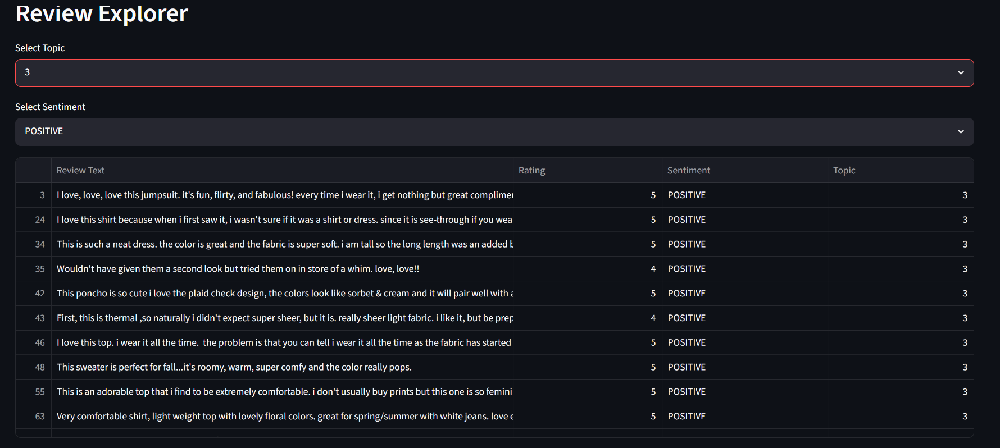
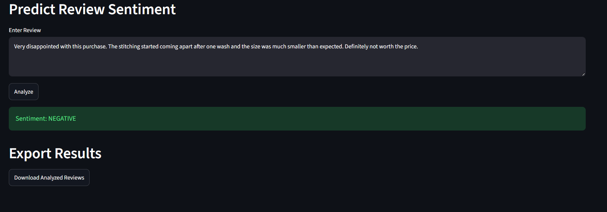

# Sentiment Analysis & Topic Modeling on Product Reviews

## Project Overview

This project is an end-to-end NLP analytics platform built on customer product reviews. It combines Sentiment Analysis, Topic Modeling, SQL Analytics, and Interactive Visualization to extract meaningful insights from customer feedback.

The application analyzes customer reviews, identifies sentiment using a pre-trained Hugging Face Transformer model, discovers key discussion topics using LDA Topic Modeling, and presents insights through an interactive Streamlit dashboard.

---

## Features

### Sentiment Analysis

* Utilized Hugging Face DistilBERT for sentiment classification.
* Classifies reviews as Positive or Negative.
* Supports real-time sentiment prediction through the dashboard.

### Topic Modeling

* Implemented Latent Dirichlet Allocation (LDA).
* Identifies major themes discussed in customer reviews.
* Groups reviews into meaningful topics for analysis.

### SQL Analytics

* Stored processed review data in SQLite.
* Performed advanced SQL queries and aggregations.
* Applied SQL Window Functions for business insights.

### Interactive Dashboard

* Built using Streamlit.
* Displays review statistics and KPIs.
* Visualizes sentiment and topic distributions.
* Includes review filtering and search functionality.
* Provides live sentiment prediction.

---

## Dataset

**Women's Clothing E-Commerce Reviews Dataset**

The dataset contains customer reviews and ratings for women's clothing products.

Key attributes include:

* Review Text
* Rating
* Recommended Indicator
* Department Name
* Class Name
* Positive Feedback Count

---

## Tech Stack

### Programming Language

* Python

### Libraries & Frameworks

* Pandas
* NumPy
* Scikit-Learn
* Hugging Face Transformers
* Streamlit
* SQLite3
* Matplotlib
* WordCloud

### NLP Techniques

* Sentiment Analysis (DistilBERT)
* Topic Modeling (LDA)
* Text Vectorization (CountVectorizer)

### Database

* SQLite

---

## Project Workflow

1. Data Collection
2. Data Cleaning and Preprocessing
3. SQLite Database Creation
4. SQL Analysis and Window Functions
5. Sentiment Analysis using DistilBERT
6. Topic Modeling using LDA
7. Dashboard Development using Streamlit
8. Interactive Sentiment Prediction

---

## Dashboard Screenshots

### Overview Dashboard



### Sentiment Analysis



### Topic Modeling



### Review Explorer



### Live Sentiment Prediction



---

## Key Insights Generated

* Overall customer sentiment distribution.
* Most discussed product topics.
* Topic-wise sentiment analysis.
* Rating versus sentiment comparison.
* Department-level review trends.
* Customer recommendation patterns.

---

## How to Run the Project

### Clone Repository

```bash
git clone https://github.com/vaishnavibodla/sentiment-analysis-topic-modeling.git
```

### Navigate to Project Directory

```bash
cd sentiment-analysis-topic-modeling
```

### Create Virtual Environment

```bash
python -m venv venv
```

### Activate Virtual Environment

Windows:

```bash
venv\Scripts\activate
```

### Install Dependencies

```bash
pip install -r requirements.txt
```

### Run Streamlit Application

```bash
streamlit run app.py
```

---

## Project Structure

```text
sentiment-analysis-project
│
├── data/
│   └── Womens Clothing E-Commerce Reviews.csv
│
├── database/
│   └── reviews.db
│
├── notebooks/
│   └── analysis.ipynb
│
├── screenshots/
│   ├── overview.png
│   ├── sentiment_analysis.png
│   ├── topic_analysis.png
│   ├── review_explorer.png
│   └── predict_review_sentiment.png
│
├── app.py
├── requirements.txt
├── README.md
└── .gitignore
```

---

